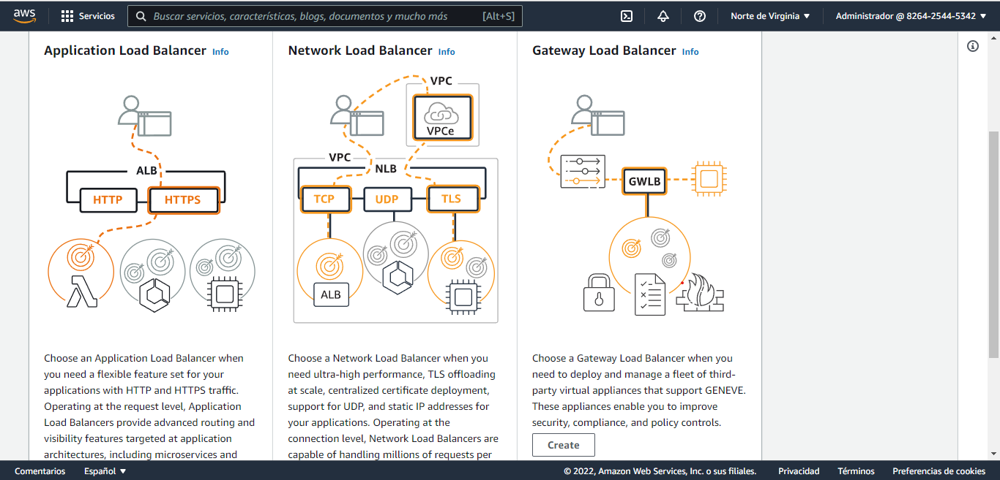

# **Proyecto 1 Seminario de Sistemas 1**

### *Indice*
1. [Integrantes](#Integrantes)
2. [Objetivos del proyecto](#Objetivos)
3. [Descripción del proyecto](#Descripcion)
2. [Arquitectura](#Arquitectura)
3. [Presupuesto](#Presupuesto)
4. [Servicios](#Servicios)

### *Integrantes Grupo 11* 
---
| Nombre        | Carné        |
|---------------|--------------|
|Fernando Augusto Armira Ramirez  |201503961|
|Carlos Ojani Ng Valladares|201801434 |
|Juan Antonio Solares Samayoa|201801434 |
|Sergio Ariel Ramírez Castro|201020252|

### *Objetivos del proyecto* 
---
* Aumentar la productividad de los estudiantes 
* Ser una comunidad activa entre los estudiantes
* Gestionar las actividades del semestre a traves de las distintas herramientas que brinda la aplicacion
* Tener comunicacion con usuarios interesados en un tema en especifico
### *Descripción del proyecto* 
---
USAC productivity App es una aplicación que ayuda a elevar la productividad de los estudiantes universitarios
La aplicación es conocida por contar con una comunidad activa de estudiantes que se ayudan
en alcanzar sus metas de estudios y compartir nuevas ideas. En esta aplicación se puede escribir notas y se pueden traducir hasta 3 idiomas diferentes y descargarlas en un archivo de texto.  Agregar eventos a un calendario para que el usuario pueda administrar su tiempo de la mejor forma.
Se permite accede a la aplicación con usuario y contraseña. Se pueden realizar grupos de estudio para poder cooperar en equipo. La aplicación contará con un bot de ayuda para los usuarios.

### *Arquitectura* 
---
 
 Para el proyecto se utilizo una arquitectura cliente-servidor. A continuación se describen los elementos que componen la arquitectura.

* Bucket de imagenes: 
Se utiliza el servicio de AWS S3 para el almacenamiento de las imagenes que carquen los usuarios desde la aplicación web.

* Base de datos: 
Motor de base de datos MySQL utilizando el servicio de AWS, RDS para operar y gestionar la base de datos en la nube. 

* Servidor web NodeJS:  
Servidor programado en nodeJS, montado en una instancia de AWS EC2

* Balanceador de carga:  
Para distribuir las peticiones de los usuarios entre los dos servidores se utilizó el servicio de AWS Load Balancing.

* Análisis de imágenes:  
Se utilizó el servicio de AWS Rekognition.

* App web:  
La aplicación web fue desarrollada con el framework React.

### *Presupuesto*
---

### *Servicios Utilizados:* 
---

### *AWS S3*
---

Vamos a Amazon S3

	Creamos un bucket , le damos un nombre Elegimos una región

	Le damos permisos al usuario, de acceso publico

	Deshabilitamos control de versiones Agregamos una etiqueta opcional

Subimos imágenes 

   
 

### *AWS EC2*
---
Instancias utilizadas con los servidores:
 

### *AWS RDS*
---
Motor de base de datos MySQL utilizando el servicio de AWS, RDS para operar y gestionar la base de datos en la nube.

Crear RDS de MySql

Sehleccionar el servicio RDS  en la parte de Database

Crear una database

Como generar el método le damos en stardard

Engine options seleccionamos MySql 

En Templates le damos en Free Tier – seleccionar esta opción para que sea gratuito

Seleccionamos nombre del usuario

Cohntraseña del usuario

En tamaño de damos por default

No mas de 20 Gb para que no se realice el cobro

En Conectividad lo dejamos en default

En la parte de Acceso publico le damos permiso que si

En VPC security group seleccionamos un grupo

En configuración del puerto le dejamos el default

Luhego seleccionamos en conectividad y seguridad y 

visualizamos el endpoint  y el puerto de la base de datos creada 

### AWS Elastic Load Balancing
---

Pasos  para configurar AWS Load Balancing:  
Desde AWS EC2, en equilibrio de carga, y luego balanceadores de carga le damos clic a crear balanceador de carga.  

Elegimos Application load balancer

Le ponemos nombre a nuestro balanceador

Seleccionamos las áreas, se recomiendan como minimo seleccionar 2

Configuramos un nuevo security group

Agregamos una nueva regla de entrada

Creamos nuestro target group

Seleccionamos instancias

Configuramos nombre y puerto

Agregamos las instancias que formaran parte del balanceador

Creamos el load balancer.

### AWS Lambda
---
AWS Lambda es un servicio informático sin servidor y basado en eventos que le permite ejecutar código para prácticamente cualquier tipo de aplicación o servicio backend sin necesidad de aprovisionar o administrar servidores.

En el proyecto se implementaron funciones lambda para utilizar el servicio de aws simple notification service atraves del aws-sdk y node js.

Para crear una nueva función desde la consola le damos clic en crear una función

Configuramos las distinas opciones como el nombre, lenguaje de programación, permisos.

Programamos nuestra funcion, para guardar le damos en deploy. Tambien podemos testear nuestra funcion.

### AWS Api gateway
---
Amazon API Gateway es un servicio completamente administrado que facilita a los desarrolladores la creación, la publicación, el mantenimiento, el monitoreo y la protección de API a cualquier escala. Las API actúan como la "puerta de entrada" para que las aplicaciones accedan a los datos.

A traves de la api gateway el frontend en react puede hacer uso de las funciones lambda previamente creadas.

Desde la consola en el servicio de api gateway le damos en crear API.

En nuestro caso seleccionamos crear api rest

Configuramos las distintas opciones, como nombre, protocolo, entre otras opciones.

En nuestra api podemos crear recursos y métodos donde podemos hacer uso de las funciones lambda.

Tenemos la opcion de habilitar CORS. Para implementar nuestra api le damos en implementar, seleccionamos o creamos una nueva fase.

### AWS Simple Notification Service
---

Amazon SNS es un servicio que permite enviar notificaciones de inserción a aplicaciones móviles, mensajes de texto a números de teléfonos móviles y correos electrónicos de texto sin formato a direcciones de correo electrónico. Puede distribuir mensajes con un tema o publicar en puntos de enlace móviles directamente.

En el proyecto se implemento este servicio a traves de funciones lambda utilizando node js.

A continuacion se muestran como usar SNS desde la consola de amazon. Para crear un nuevo tema damos en crear tema.

Configuramos los protocolos de suscripcion, nombre del tema entre otras opciones. 

Podemos gestionar las suscripciones de los distintos temas.

Para enviar un mensaje, entramos al tema y luego en publicar mensaje.

