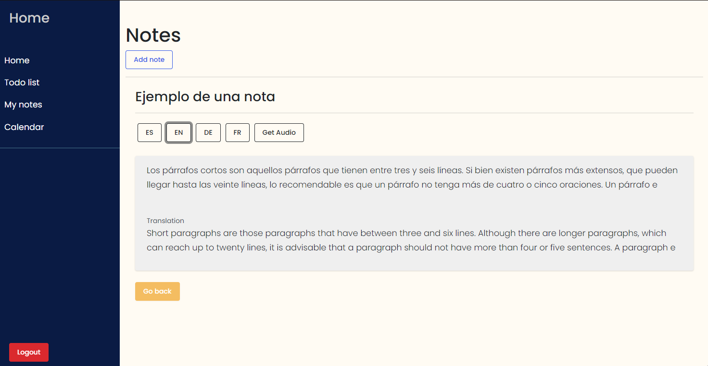

# :raising_hand: MANUAL USUARIO

## Grupo #11 - Seminario de Sistemas 1

| Nombre        | Carné        |
|---------------|--------------|
|Fernando Augusto Armira Ramirez  |201503961|
|Carlos Ojani Ng Valladares|201801434 |
|Juan Antonio Solares Samayoa|201801434 |
|Sergio Ariel Ramírez Castro|201020252|

## :closed_book: Descripción de la aplicación

Es una aplicación que ayuda a aumentar la productividad de los estudiantes universitarios.

La aplicación es conocida por contar con una comunidad activa de estudiantes que se ayudan en alcanzar sus metas de estudios y compartir nuevas ideas.

## :closed_book: Funcionalidades principales de la aplicación

En esta aplicación se puede escribir notas y se pueden traducir hasta 3 idiomas diferentes y descargarlas en un archivo de texto. Así como agregar eventos a un calendario para que el usuario pueda administrar su tiempo de la mejor forma. 

<!-- 

Se permite acceder a la aplicación con usuario y contraseña así como también a través de reconomiento facial. 

 -->

* Toma notas, que pueden ser traducidos o generar un archivo de audio para escucharlas
* Lista todas las actividades que realizarás acorde a un tiempo estimado. 
* Ingresa eventos a tu calendario personal para llevar control de tus actividades a futuro.

# Vistas de la aplicación

### :white_check_mark: Login

 
En esta sección el usuario puede ingresar a la aplicación con su número de carnet y su contraseña

### :white_check_mark: Registro

 
En esta sección el usuario puede registrar un nuevo usuario con datos como:

* Nombre completo
* Numero de carnet
* Carrera
* Contraseña
* Foto de perfil

### :white_check_mark: Home

 
En esta sección de la aplicación el usuario puede ver sus datos y modificar su usuario, y también ver el analisis mediante de su foto de perfil gracias a Rekognition de AWS. 

### :white_check_mark: Notas

### :white_check_mark: Traducción de notas

 
En esta sección de la aplicación el usuario puede visualizar sus notas así como también la traducción al idioma inglés, alemán, y frances, como una función para poder aprender nuevas palabras

### :white_check_mark: Extracción texto de imagenes

 
En esta sección de la aplicación el usuario puede extraer el texto de una imagen, para poder agregarla a una nueva nota, lo cual es muy útil en casos que se tengan fotos con mucho texto y poder obtener convertir ese texto de forma rápida sin perder datos.

### :white_check_mark: Tareas Rapidas (Todos)

 
En esta sección de la aplicación el usuario puede crear, completar y eliminar notas rapidas, las cuales pueden servir como recordatorios para hacer tareas pequeñas.

### :white_check_mark: Calendario

En está sección de la aplicación el usuario puede agregar eventos a su agenda, para poder tener organizada de mejor manera sus actividades, a continuación se muestran dos vistas que muestran su funcionamiento.

### :white_check_mark: Topics

En esta sección se pueden crear temas y los estudiantes que se suscriban al tema reciben por correo mensajes o avisos relacionados al tema.

